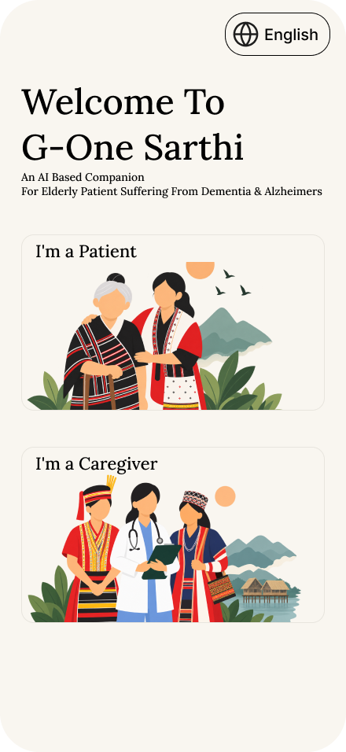
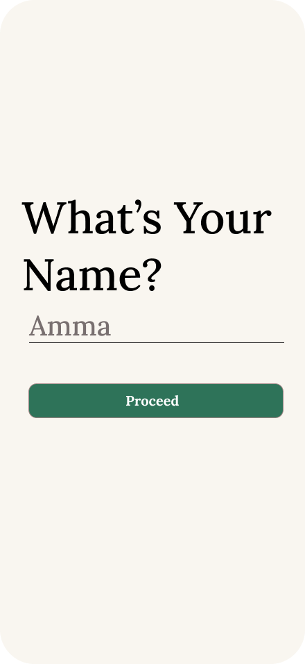
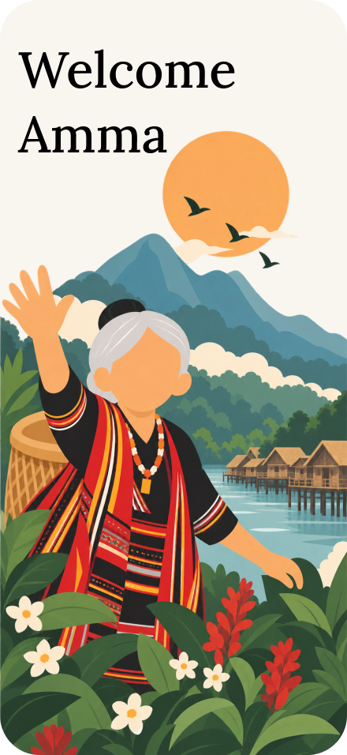
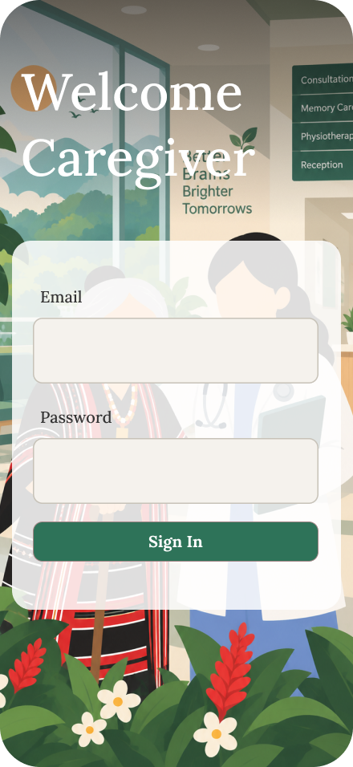
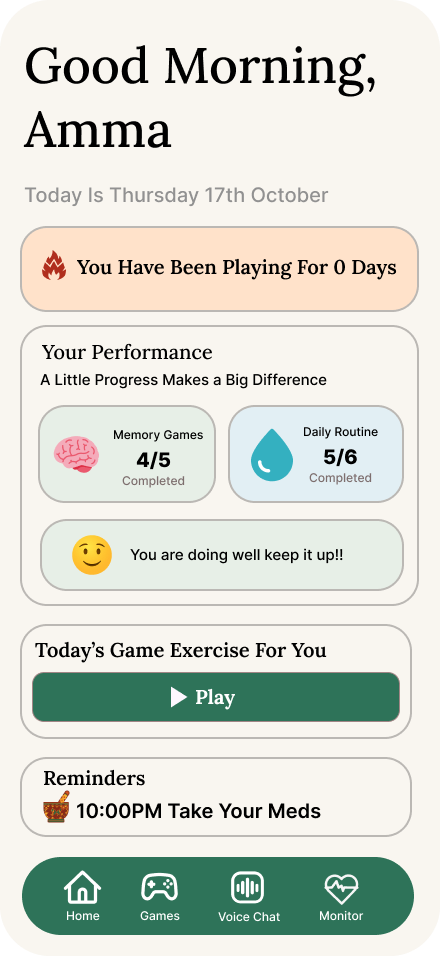
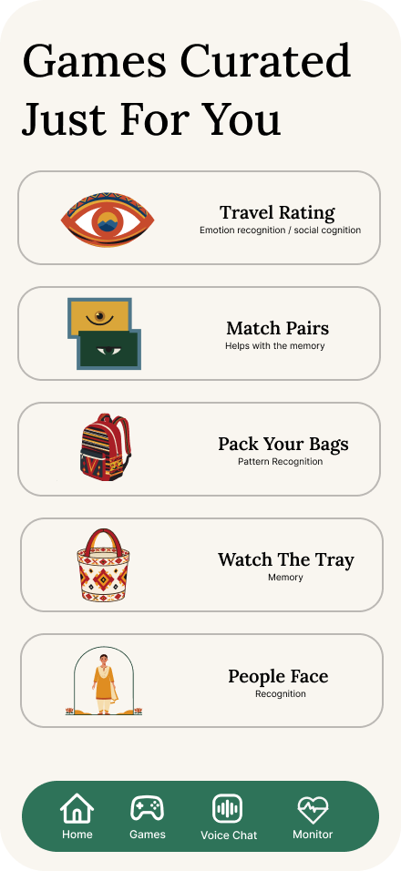
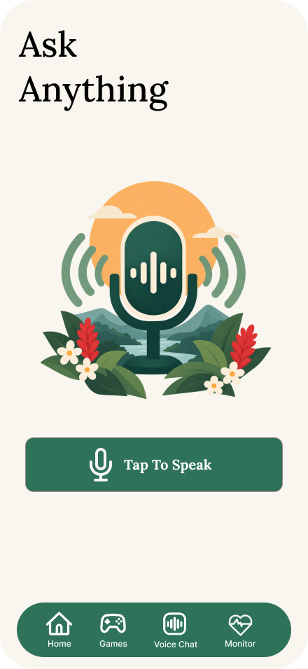

# G-One Sarthi

**AI-powered cognitive assistance for elderly dementia & Alzheimer's patients in North East India**

*Smart India Hackathon 2026*

---

## About

G-One Sarthi is a mobile cognitive-assistance platform built for elderly dementia and Alzheimer's patients in the **North Eastern Region of India**, where access to neurological care and cognitive therapy is severely limited — especially in rural areas.

The app serves two user types:

- **Patients** — engage with adaptive cognitive games and daily reminders
- **Caregivers** — monitor patient progress through an analytics dashboard

Everything is wrapped in a **culturally grounded, NE Indian visual and linguistic context**, making cognitive therapy feel familiar rather than clinical.

Built with **React Native**, **TypeScript**, **AsyncStorage**, and **react-native-svg**.

---

## Problem Statement

The North Eastern Region of India faces a growing burden of age-related cognitive disorders among its elderly population. Patients with dementia experience memory decline, confusion, anxiety, and social isolation, while caregivers struggle with continuous monitoring and engagement. Compounding this, there are **few affordable digital therapeutic solutions** tailored to NER's cultural and linguistic context.

## Solution

| Capability | Description |
|---|---|
| **Adaptive Cognitive Games** | Target memory, attention, pattern recognition, emotional recognition, and face recognition — all with NE Indian themed visuals |
| **Reminder System** | Caregivers or patients set daily medication, hydration, and activity reminders with a native time picker |
| **Caregiver Dashboard** | Today's completion summary, day streak, reminder adherence, last active time, 7-day activity chart |
| **Daily Streak Tracker** | Records consecutive engagement days, persists across app restarts |

---

## Onboarding Flow

| Role Selection | Patient Name Entry | Welcome Screen | Caregiver Login |
|:---:|:---:|:---:|:---:|
|  |  |  |  |
| Identify as patient or caregiver, select language (English, Hindi, Assamese, Bodo) | Patient enters name for personalised greetings | Culturally themed welcome illustration, tap to continue | Caregivers log in with email & password |

## Application Screens

| Home | Games | Voice Assistant | Monitor & Analytics |
|:---:|:---:|:---:|:---:|
|  |  |  |  |
| Greeting, streak, progress, quick play, next reminder | All 5 cognitive games | Planned multilingual voice interaction | Reminders + full analytics dashboard |

---

## Games

Each game targets a specific cognitive domain relevant to dementia care.

| Game | Cognitive Domain | Description |
|---|---|---|
| **Travel Rating** | Emotional Recognition | Recognise emotions from facial expressions using NE Indian face illustrations across 6 rounds |
| **Match Pairs** | Memory | Classic memory card flip game with 8 pairs of NE Indian themed images |
| **Pack Your Bags** | Reasoning | Choose the correct item to pack for Maya's trip across 6 scenario-based rounds |
| **Watch The Tray** | Attention & Recall | Memorise household objects on a tray, then recall which were present — Easy, Medium, Hard |
| **People Face** | Face Recognition | View 4 faces with name badges for 8 seconds, then get quizzed on each |

---

## Monitor & Analytics

The caregiver and patient monitor screen has two sections:

**Reminders**
- Add, edit, and delete daily reminders
- Native clock time picker
- Icon selection for medicine, water, and walking activities

**Analytics**
- Today summary card — games played, current streak, reminders completed
- Last active card — when the patient last opened the app
- Reminders-today progress bar
- 7-day activity bar chart — games played per day
- Per-game performance list — games completed today

---

## Project Context

| | |
|---|---|
| **Competition** | Smart India Hackathon 2026 |
| **Problem Domain** | Elderly healthcare and cognitive assistance in NER India |
| **Target Users** | Elderly dementia and Alzheimer's patients and their caregivers in rural and remote NE India |